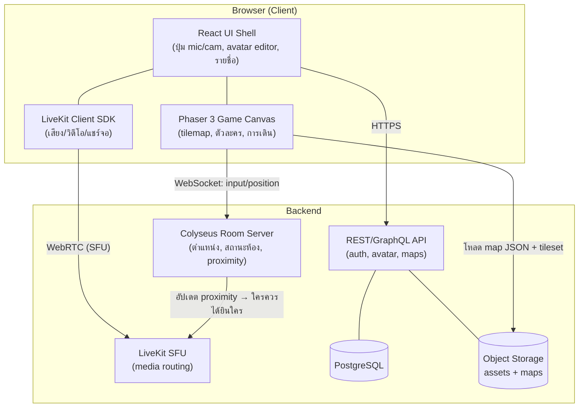
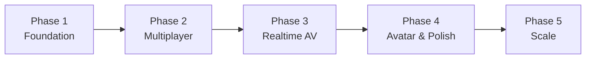

# NexSpace — เอกสารออกแบบระบบ (Design & Architecture)

> เว็บแอปพลิเคชัน "ออฟฟิศเสมือน" (virtual office) แนวเดียวกับ Gather Town
> เดินตัวละครในแผนที่ 2D แบบ top-down เจอกันแล้วคุยกันด้วยเสียง/วิดีโอตามระยะใกล้ไกล
> แชร์หน้าจอ สร้าง avatar ได้เอง และ asset ทุกชิ้นออกแบบให้ทำงานร่วมกับ **Tiled Map Editor**

เอกสารชุดนี้เป็น **blueprint** ก่อนลงมือเขียนโค้ดจริง อ่านตามลำดับได้เลย

| # | เอกสาร | เนื้อหา |
|---|--------|--------|
| 00 | **overview** (ไฟล์นี้) | ภาพรวม, tech stack, roadmap, โครงสร้างโปรเจกต์ |
| 01 | [tech-architecture](01-tech-architecture.md) | สถาปัตยกรรมระบบ, client/server, สโคปการซิงก์สถานะ |
| 02 | [asset & Tiled pipeline](02-asset-and-tiled-pipeline.md) | ระบบ asset, ผนัง autotile, prefab room, workflow กับ Tiled |
| 02a | [wall tileset spec](02a-wall-tileset-spec.md) | สเปกผนัง 47-tile blob + ภาพอ้างอิง (สำหรับทีมศิลป์) |
| 02b | [base & prefab spec](02b-base-and-prefab-spec.md) | สเปกพื้น + เฟอร์นิเจอร์ + prefab room + ภาพอ้างอิง |
| 03 | [office-sizes](03-office-sizes.md) | ออฟฟิศ 4 ขนาด + ขนาด grid + layout |
| 04 | [realtime-features](04-realtime-features.md) | การเดิน, proximity chat, mic/cam, screen share |
| 05 | [avatar-system](05-avatar-system.md) | ระบบสร้างตัวละคร layered sprite |
| 05a | [pixellab avatar prompts](05a-pixellab-avatar-prompts.md) | prompt สั่ง PixelLab สร้าง avatar (ครบ+ครอบคลุม) |
| 06 | [pixel-art style & AI prompts](06-pixel-art-style-and-ai-prompts.md) | ⭐ สไตล์ **pixel art** (Stardew/Gather) + เครื่องมือ AI + คลัง prompt Gemini |
| 07 | [asset processing workflow](07-asset-processing-workflow.md) | ลำดับงานแปลงภาพ Gemini → Tiled → Phaser (12 step) |
| 08 | [Aseprite cleanup guide](08-aseprite-cleanup-guide.md) | วิธี redraw/เก็บ asset ที่ 32px โดยใช้ full-res เป็นแบบ |

> 🎨 **หมายเหตุสไตล์:** งานศิลป์ล่าสุดเป็นแนว **pixel art** — spec/layout ทุกเอกสาร (02, 02a, 02b, 05) ยังใช้ได้เหมือนเดิม เปลี่ยนเฉพาะการ render ดู [06](06-pixel-art-style-and-ai-prompts.md)

---

## 1. หลักการออกแบบ (Design Principles)

1. **สวย สะอาดตา เป็นระบบเดียวกัน** — asset ทุกชิ้นอยู่บน grid เดียวกัน, palette เดียวกัน, สไตล์ top-down 2.5D (ผนังมีความสูงหลอกตา)
2. **Tiled-first** — แผนที่ทุกอันสร้าง/แก้ใน Tiled แล้ว export เป็น JSON โค้ดไม่ต้อง hardcode แผนที่เลย นักออกแบบแมพทำงานแยกจาก dev ได้
3. **Data-driven** — collision, จุดเกิด (spawn), โซนคุยส่วนตัว (private area), จุดแชร์จอ ฯลฯ กำหนดผ่าน object layer ใน Tiled ไม่ใช่ในโค้ด
4. **Authoritative server** — ตำแหน่งผู้เล่นและสถานะห้องตัดสินที่ server กันโกง/กันเดสซิงก์
5. **แยกชั้น media ออกจาก game state** — ตำแหน่ง/การเดินวิ่งบน WebSocket ที่เบา ส่วนเสียง/วิดีโอวิ่งบน WebRTC SFU แยกกัน

---

## 2. Tech Stack ที่แนะนำ

เลือกจากเกณฑ์: รองรับ Tiled โดยตรง, จัดการ multiplayer state ได้ดี, WebRTC ที่ scale ได้จริงถึงห้อง 50+ คน, และ ecosystem ที่ TypeScript ครอบทั้งหมด (ทีมดูแลง่าย)

| ชั้น | เทคโนโลยี | เหตุผล |
|------|-----------|--------|
| **Rendering / Game** | **Phaser 3** (TypeScript) | มี `TilemapJSON` loader อ่านไฟล์ Tiled ตรง ๆ, มี arcade physics, animation, camera สำเร็จ ลดเวลาเขียน engine เอง |
| **UI Shell** | **React 18 + Vite** | UI รอบเกม (เมนู, ปุ่ม mic/cam, รายชื่อคน, modal สร้าง avatar) ทำเป็น React overlay ครอบ canvas ของ Phaser |
| **Realtime state** | **Colyseus** (Node.js) | authoritative room server สำหรับ multiplayer โดยเฉพาะ มี state sync (schema + binary patch) ประหยัด bandwidth, room lifecycle, matchmaking พร้อม |
| **Transport** | WebSocket (ผ่าน Colyseus) | ส่ง input/ตำแหน่ง latency ต่ำ |
| **Audio/Video (SFU)** | **LiveKit** (แนะนำ) หรือ mediasoup | SFU scale ถึงห้องใหญ่ได้, มี client SDK, spatial audio, screen share track, track-level mute — LiveKit deploy ง่ายกว่า / mediasoup คุมเองได้ลึกกว่า |
| **Auth & Data** | **PostgreSQL + Prisma**, Auth ด้วย Lucia/Auth.js | เก็บ user, avatar config, ผังห้องที่บันทึกไว้ |
| **Object storage** | S3-compatible (เช่น MinIO / R2) | เก็บ asset, tileset, map JSON, รูป avatar preview |
| **Infra** | Docker + reverse proxy (Caddy/Nginx) | LiveKit และ Colyseus แยก service, scale แนวนอนได้ |

> **ทำไมไม่เลือก PixiJS ล้วน?** PixiJS เป็น renderer อย่างเดียว ต้องเขียน tilemap loader / physics / camera เอง Phaser ให้ของพวกนี้มาพร้อมและใช้ PixiJS-style rendering อยู่แล้วภายใน จึงเร็วกว่าสำหรับ MVP ถ้าอนาคตต้องการคุม render pipeline ละเอียดมาก ค่อยพิจารณา custom PixiJS ทีหลังได้

### สรุป stack เป็นภาพ



---

## 3. โครงสร้างโปรเจกต์ (Monorepo)

```
nex-space/
├─ docs/                     # เอกสารออกแบบ (ชุดนี้)
├─ apps/
│  ├─ web/                   # React + Phaser client (Vite)
│  │  ├─ src/game/           # Phaser scenes, systems (movement, proximity)
│  │  ├─ src/ui/             # React components (HUD, avatar editor)
│  │  └─ src/net/            # Colyseus + LiveKit client wrappers
│  ├─ game-server/           # Colyseus rooms + schema
│  └─ api/                   # REST API (auth, avatar, map storage)
├─ packages/
│  ├─ shared/                # types ที่ client/server ใช้ร่วม (schema, enums)
│  └─ map-tools/             # สคริปต์ validate/แปลง map จาก Tiled
├─ assets/
│  ├─ tilesets/              # ไฟล์ .png + .tsx (Tiled tileset)
│  ├─ maps/                  # ไฟล์ .tmx (source) + .json (export)
│  ├─ templates/             # prefab rooms (.tx templates ของ Tiled)
│  └─ avatars/               # spritesheet ชิ้นส่วน avatar
└─ infra/                    # docker-compose, config LiveKit/Colyseus
```

หลักการ: **`assets/` คือแหล่งความจริงของงานศิลป์และแผนที่** — ทีมกราฟิก/level design ทำงานใน Tiled ตรงนี้, dev เขียนโค้ดใน `apps/` โดยอ่านจาก export JSON

---

## 4. Roadmap แบ่งเฟส



| เฟส | เป้าหมาย | สิ่งที่ได้ |
|-----|---------|-----------|
| **1 — Foundation** ✅ | โหลดแผนที่ + เดินตัวละครคนเดียว | ✅ ออฟฟิศเล็ก compact **20×15** (open desk 6 ที่, meeting room, pantry, reception, plants), movement+collision, walk anim (PixelLab), decor — `apps/web` |
| **2 — Multiplayer** ✅ | หลายคนในห้องเดียว เห็นกันเดินได้ | ✅ Colyseus `office` room, state sync, remote interpolation+anim, ป้ายชื่อ — `apps/game-server` |
| **3 — Realtime AV** ✅ | proximity chat + mic/cam + screen share | ✅ **3a**: server proximity, กรอบสนทนา (ring), text chat ตามระยะ · ✅ **3b**: **WebRTC P2P** mic/cam/screen (perfect-negotiation, signaling ผ่าน Colyseus, proximity สั่ง connect/disconnect) — ต้องเทสต์ AV จริงบน 2 เครื่อง |
| **4 — Avatar & Polish** | สร้าง avatar เอง + กรอบสนทนา + UI | layered avatar, name bubble, chat UI |
| **5 — Scale** 🚧 | ห้องใหญ่ + interest management | ✅ **LiveKit SFU** (ทางเลือก, สลับ P2P↔SFU อัตโนมัติ): จอแชร์/เสียง room-wide, spatial audio, subscribe วิดีโอตามระยะ — `apps/game-server` token endpoint · ⬜ interest management/แบ่งโซน สำหรับ 50+ |

รายละเอียดทางเทคนิคของแต่ละส่วนอยู่ในเอกสาร 01–05
