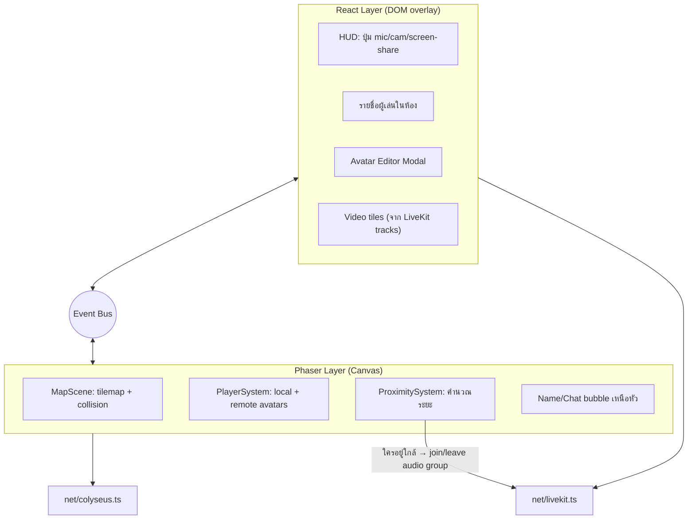
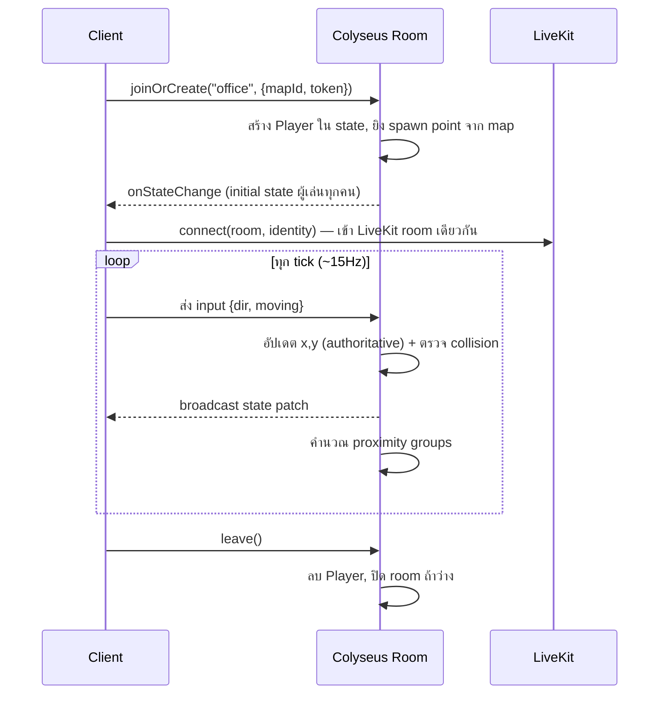
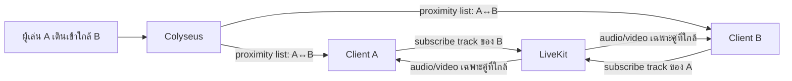

# 01 — สถาปัตยกรรมระบบ (Technical Architecture)

เอกสารนี้ลงรายละเอียด client/server, การซิงก์สถานะ และการแบ่งความรับผิดชอบ

---

## 1. ภาพรวมการแยกความรับผิดชอบ

หัวใจของงานแบบ Gather คือ **แยก "game state" ออกจาก "media stream"** เด็ดขาด

| ระบบ | วิ่งบน | ความถี่ | ข้อมูล |
|------|--------|---------|--------|
| ตำแหน่ง/การเดิน/สถานะห้อง | Colyseus (WebSocket) | ~10–20 Hz | เล็กมาก (x, y, dir, state) |
| เสียง/วิดีโอ/แชร์จอ | LiveKit (WebRTC SFU) | media rate | หนัก แต่ SFU กระจายให้ |
| auth, avatar config, บันทึกแมพ | REST API (HTTPS) | ตอนโหลด/แก้ | JSON |

เหตุผล: ถ้าเอาทุกอย่างไปกองบน WebRTC data channel จะจัดการ authority/persistence ยาก และถ้ายัด media ลง WebSocket จะ scale ไม่ไหว การแยกแบบนี้คือแพตเทิร์นเดียวกับที่ Gather ใช้จริง

---

## 2. Client architecture (Phaser + React)

React เป็น "เปลือก" (shell) ครอบ Phaser canvas — Phaser ดูแลโลกในเกม, React ดูแล UI รอบ ๆ ทั้งสองคุยกันผ่าน event bus กลาง (เช่น `mitt` หรือ Phaser's `EventEmitter`)



**ตัวอย่างการไหลของ event:**
- ผู้เล่นกดปุ่ม mic ใน React → ยิง event `toggle-mic` → `net/livekit.ts` สั่ง LiveKit mute/unmute track
- `ProximitySystem` ใน Phaser เจอว่าผู้เล่น A เข้าใกล้ B → ยิง event `proximity-enter` → subscribe track เสียง/วิดีโอของ B และให้ React เปิด video tile

### Phaser Scenes ที่ควรมี
| Scene | หน้าที่ |
|-------|--------|
| `BootScene` | โหลด config, ต่อ Colyseus |
| `PreloadScene` | โหลด tileset, map JSON, avatar spritesheet |
| `MapScene` | เรนเดอร์แผนที่ + ผู้เล่น + ระบบต่าง ๆ (scene หลัก) |
| `UIScene` | overlay ในเกม (ถ้าบางอย่างอยากวาดบน canvas เช่น interaction prompt) |

---

## 3. Server architecture (Colyseus)

Colyseus จัดการ **"ห้อง" (Room)** = พื้นที่ออฟฟิศหนึ่งใบ ทุก client ในออฟฟิศเดียวกัน join room เดียวกัน

### State Schema (authoritative)
Colyseus ใช้ schema ที่ sync แบบ binary patch (ส่งเฉพาะส่วนที่เปลี่ยน) ตัวอย่างโครง:

```ts
// packages/shared/schema.ts
class Player extends Schema {
  @type("string") id: string;
  @type("string") name: string;
  @type("number") x: number;        // ตำแหน่งเป็นพิกัด world (px)
  @type("number") y: number;
  @type("string") dir: string;      // "up"|"down"|"left"|"right"
  @type("boolean") moving: boolean;
  @type("string") avatarId: string; // ชี้ไป config avatar
  @type("boolean") micOn: boolean;
  @type("boolean") camOn: boolean;
  @type("string") status: string;   // "available"|"busy"|"away"
  @type("string") zoneId: string;   // โซนปัจจุบัน (private area / meeting)
}

class OfficeState extends Schema {
  @type({ map: Player }) players = new MapSchema<Player>();
  @type("string") mapId: string;
}
```

### Room lifecycle


### ทำไม server ต้อง authoritative ตำแหน่ง?
- กันโกง (teleport, ทะลุกำแพง)
- proximity ที่ใช้คุมว่า "ใครได้ยินใคร" ต้องเชื่อถือได้ ไม่งั้น client ปลอมระยะเพื่อแอบฟังได้
- แหล่งความจริงเดียวสำหรับ reconnect

> **หมายเหตุ movement:** ใช้ **client-side prediction + server reconciliation** — client เดินทันทีตอนกดปุ่ม (ไม่รอ round-trip) แล้ว server ยืนยัน ถ้าต่างก็ค่อยแก้ตำแหน่ง ทำให้ลื่นเหมือน Gather รายละเอียดใน [04-realtime-features](04-realtime-features.md)

---

## 4. การเชื่อม Colyseus ↔ LiveKit (proximity → media)

จุดสำคัญที่ทำให้ "เดินเข้าใกล้แล้วได้ยิน":

1. **Server เป็นคนตัดสิน proximity** — ทุก tick, Colyseus คำนวณว่าใครอยู่ในระยะกันบ้าง (หรืออยู่โซนเดียวกัน)
2. Server ส่งรายการ "peers ที่ควรเชื่อมสื่อ" ให้แต่ละ client
3. **Client เป็นคน subscribe/unsubscribe track** ใน LiveKit ตามรายการนั้น (LiveKit ให้ client เลือก subscribe เฉพาะ track ที่ต้องการได้ = ประหยัด bandwidth มหาศาลในห้องใหญ่)



ทางเลือกความดัง: ทำ **spatial audio** โดยปรับ volume ตามระยะ (ใกล้ = ดัง, ไกล = เบาแล้วตัด) ได้ผ่าน Web Audio API ที่ฝั่ง client

---

## 5. Interest management (สำหรับห้องใหญ่ 50+ คน)

ห้องใหญ่มากส่งสถานะทุกคนให้ทุกคนไม่ไหว ใช้เทคนิค:

- **Spatial grid / cells** — แบ่งแผนที่เป็นตาราง client รับ update เฉพาะผู้เล่นใน cell รอบตัว (Colyseus มี `@colyseus/proximity` หรือทำ filter เอง)
- **State filtering** — Colyseus รองรับ `@filter()` ส่ง field เฉพาะ client ที่เกี่ยวข้อง
- **Video ไม่มีวันเปิดพร้อมกัน 50 จอ** — proximity คุมให้ subscribe เฉพาะคนใกล้อยู่แล้ว โดยธรรมชาติ

รายละเอียดการแบ่งโซนตามขนาดออฟฟิศอยู่ใน [03-office-sizes](03-office-sizes.md)

---

## 6. สรุปการตัดสินใจเชิงสถาปัตยกรรม (ADR ย่อ)

| ประเด็น | ตัดสินใจ | เหตุผลหลัก |
|--------|---------|-----------|
| Game engine | Phaser 3 | รองรับ Tiled JSON ตรง, ลดเวลา MVP |
| Multiplayer | Colyseus | authoritative + binary state sync สำเร็จรูป |
| Media | LiveKit SFU | selective subscribe = ประหยัด, scale ห้องใหญ่ได้ |
| Movement | grid-aware + prediction | ลื่นแบบ Gather แต่กันโกง |
| Map | Tiled JSON, data-driven | แยกงาน level design ออกจากโค้ด |
| ภาษา | TypeScript ทั้ง stack | type ร่วมกันใน `packages/shared` |
