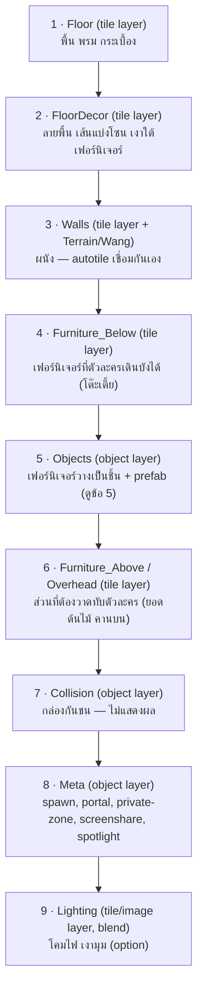
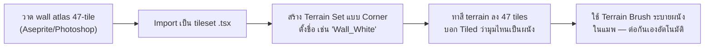

# 02 — ระบบ Asset & Tiled Pipeline

เอกสารนี้คือหัวใจของงานศิลป์: กำหนดมาตรฐาน tile, ระบบผนังที่เชื่อมต่อกันอัตโนมัติ (autotile),
prefab room สำเร็จรูป และ workflow การทำงานกับ **Tiled Map Editor** จนถึง export เข้าโค้ด

---

## 1. มาตรฐาน Grid & ขนาด Tile

| พารามิเตอร์ | ค่า | เหตุผล |
|------------|-----|--------|
| **Logical tile size** | **32 × 32 px** | มาตรฐานเดียวกับ Gather Town, ลงตัวกับการเดินแบบ grid |
| **Art resolution** | วาด asset ที่ **2×** (64×64 ต่อ tile) แล้วให้ engine scale | คมบนจอ retina, zoom เข้าไม่แตก |
| **Character footprint** | 1 tile กว้าง (32px) แต่ sprite สูง ~2 tiles (48–64px) | หัวโผล่เหนือ tile ที่ยืน = ดูมีมิติ |
| **Wall height** | ผนังสูง 2 tiles (ฐาน 1 + ส่วนสูง 1) | top-down 2.5D มองเห็นด้านหน้าผนัง |

> **กฎเหล็ก:** ทุก asset ต้อง snap กับ grid 32px และ origin สม่ำเสมอ (มุมซ้ายบน) เพื่อให้ต่อกันเนียน

### สไตล์อาร์ต
> 🎨 **สไตล์ปัจจุบัน = pixel art** (แนว Stardew Valley / Gather Town) — รายละเอียด palette, resolution, outline, และ prompt AI อยู่ใน [06](06-pixel-art-style-and-ai-prompts.md) หลักการ grid/layout ด้านล่างยังใช้เหมือนเดิม

- **มุมมอง:** top-down เอียงเล็กน้อย (2.5D) — พื้นมองจากบน, ผนัง/เฟอร์นิเจอร์เห็นด้านหน้านิดหน่อย
- **โทน:** สะอาด flat-ish + soft shadow, เส้น outline บาง, palette จำกัด (ดูข้อ 6)
- **แสง:** ทิศเดียวสม่ำเสมอ (เช่นแสงจากบน-ซ้าย) เพื่อให้เงาทุกชิ้นไปทางเดียวกัน

---

## 2. โครงสร้าง Layer ใน Tiled (สำคัญมาก)

แผนที่ทุกใบใช้ layer เรียงตามนี้ (ล่างสุด = วาดก่อน = อยู่หลัง):



### รายละเอียดแต่ละ layer
| Layer | ชนิด | โค้ดเอาไปทำอะไร |
|-------|------|----------------|
| `Floor`, `FloorDecor` | tile | เรนเดอร์พื้น อยู่หลังสุด |
| `Walls` | tile (Wang/Terrain) | เรนเดอร์ + มัก set ให้มี collision อัตโนมัติ |
| `Furniture_Below` | tile | เรนเดอร์ใต้ตัวละคร |
| `Objects` | object | วาง sprite เดี่ยว/prefab, ใส่ custom property ต่อชิ้น |
| `Furniture_Above` | tile | **y-sort/overhead** วาดทับตัวละครเพื่อให้เดิน "หลัง" ของได้ |
| `Collision` | object (rectangle/polygon) | สร้าง static body กันชน |
| `Meta` | object (point/rectangle) | จุดเกิด, ประตูข้ามแมพ, โซนคุยส่วนตัว, จุดแชร์จอ |
| `Lighting` | image/tile | overlay แสงเงา (multiply/screen) เพิ่มบรรยากาศ |

> **Y-sorting (การเดินหน้า-หลังของ):** ของบางชิ้น (เก้าอี้พนักสูง, ตู้, ต้นไม้) ตัวละครต้องเดินบังได้เมื่ออยู่ด้านหน้า และถูกบังเมื่ออยู่ด้านหลัง วิธีที่แนะนำ: วางของสูงใน `Objects` layer แล้วให้ Phaser ทำ **depth = y-coordinate** ทั้งของและตัวละคร (ยิ่ง y มาก = อยู่หน้า = depth สูง) ส่วนที่ "ต้องทับตลอด" เช่นยอดไม้ ให้แยกไป `Furniture_Above`

---

## 3. ระบบผนังเชื่อมต่ออัตโนมัติ (Wall Autotiling) ⭐

นี่คือส่วนที่ผู้ใช้เน้น — ผนังต้องต่อกันเนียนไม่ว่าจะวาดรูปทรงห้องแบบไหน ใช้ **Wang tiles / Terrain Sets** ของ Tiled

### 3.1 หลักการ
แทนที่จะวาดผนังทีละชิ้น (มุม, แนวตรง, ปลาย) ให้เตรียม **tileset ผนังชุดเดียว** ที่ Tiled รู้ว่า tile ไหนต่อกับ tile ไหน แล้วเราแค่ "ระบาย" (paint) ด้วย Terrain brush — Tiled เลือก tile มุม/ขอบ/แยก ให้เองอัตโนมัติ

Tiled มี 2 แบบ:
- **Corner-set (Blob)** — 47 tiles ครบทุกกรณี ผนังหนา/พื้นที่ใหญ่ ต่อเนียนสุด
- **Edge-set** — 16 tiles สำหรับผนังบาง/เส้น เพียงพอสำหรับสไตล์ออฟฟิศ minimal

**แนะนำสำหรับ NexSpace:** ใช้ **Blob 47-tile** สำหรับผนังหลัก (ต่อได้ทุกมุม) เพราะออฟฟิศมีห้องรูปทรงหลากหลาย

> 📐 **สเปกลงมือวาดจริง + ภาพอ้างอิงครบ 47 tiles อยู่ใน [02a-wall-tileset-spec](02a-wall-tileset-spec.md)** (ทีมศิลป์เริ่มจากไฟล์นั้นได้เลย)

### 3.2 เลย์เอาต์ tileset ผนัง (Blob / 8-neighbor)
จัดเรียง atlas ผนังตามแพทเทิร์นมาตรฐานที่ tool (เช่น Tiled หรือ tilesetter) เข้าใจ:

```
กรณีที่ต้องมีใน tileset ผนัง 1 ธีม (ตัวอย่างเชิงตรรกะ):
┌─────────────────────────────────────────────┐
│  ▛▀▜   แนวนอนบน      ▙▄▟  แนวนอนล่าง          │
│  ▌ ▐   แนวตั้งซ้าย/ขวา                          │
│  ▛ ▜ ▙ ▟   มุมนอก 4 ทิศ                        │
│  ┣ ┫ ┳ ┻   สามแยก (T-junction) 4 ทิศ          │
│  ╋   สี่แยก (cross)                            │
│  ● ═ ║   ปลายผนัง / เสาเดี่ยว                    │
│  + ชุด "มุมใน" (inner corner) สำหรับ blob 47   │
└─────────────────────────────────────────────┘
```

ในเชิงงานจริง เราไม่ต้องนับเองทีละอัน — วาด atlas ให้ครบ 47 กรณีของ blob (มี template layout มาตรฐานให้ดาวน์โหลด) แล้วใน Tiled ไปที่ **Tileset → Add Terrain Set → Corner type** แล้วระบายสี terrain ลงแต่ละ tile ตามตำแหน่ง

### 3.3 workflow การทำผนังใน Tiled


### 3.4 หลายธีมผนัง
เตรียมผนังหลายธีม (แต่ละธีมเป็น Terrain Set แยก) เช่น:
- `Wall_White` — ออฟฟิศโมเดิร์นสีขาว
- `Wall_Glass` — ผนังกระจก (ห้องประชุม)
- `Wall_Brick` — อิฐเปลือย (โซน lounge/cafe)
- `Wall_Wood` — ไม้ (โซนพักผ่อน)

ทุกธีมใช้ **layout ตำแหน่ง tile เดียวกัน** ต่างแค่ภาพ → สลับธีมง่าย, ต่อกันได้ถ้าออกแบบให้ขอบตรงกัน

### 3.5 ให้ผนังมี collision อัตโนมัติ
ใน tileset ผนัง ใส่ **custom property `collides = true`** ที่ tile ผนัง (Tiled → Tile Collision Editor หรือ property) เวลาโหลดเข้า Phaser ใช้ `setCollisionByProperty({ collides: true })` — ไม่ต้องวาด collision box เอง

---

## 4. Tile & Object naming / custom properties (สัญญาระหว่างศิลป์กับโค้ด)

โค้ดอ่านแผนที่ผ่าน **custom properties** ที่กำหนดใน Tiled กำหนดเป็น "สัญญา" ให้ชัด:

### 4.1 Custom Types (ตั้งใน Tiled: Project → Custom Types)
สร้าง object type ล่วงหน้าเพื่อให้นักออกแบบเลือกจาก dropdown (กันพิมพ์ผิด):

| Object Type | property | ความหมาย |
|-------------|----------|----------|
| `Spawn` | `spawnGroup: string` | จุดเกิดผู้เล่น (สุ่มในกลุ่มเดียวกัน) |
| `Portal` | `targetMap: string`, `targetSpawn: string` | ประตูข้ามแมพ/ชั้น |
| `PrivateZone` | `zoneId: string`, `capacity: int` | โซนคุยส่วนตัว (คนในโซนได้ยินเฉพาะกันเอง) |
| `MeetingRoom` | `zoneId`, `capacity`, `screenTargetId` | ห้องประชุม + จุดแชร์จอประจำห้อง |
| `ScreenShare` | `screenId: string` | จุดยืนเพื่อแชร์จอขึ้นจอใหญ่ในฉาก |
| `Spotlight` | `radius: int` | โซนพูดให้ทุกคนในแมพได้ยิน (เวที/ประกาศ) |
| `InteractObject` | `action: string`, `url?: string` | วัตถุกดโต้ตอบ (ไวท์บอร์ด, ลิงก์เอกสาร, เกม) |
| `Seat` | `seatId`, `dir` | เก้าอี้ที่นั่งได้ (snap ตัวละคร + หันทิศ) |

### 4.2 ตัวอย่าง object ใน map JSON ที่ export ออกมา
```json
{
  "name": "meeting-a",
  "type": "PrivateZone",
  "x": 320, "y": 256, "width": 256, "height": 192,
  "properties": [
    { "name": "zoneId", "type": "string", "value": "meeting-a" },
    { "name": "capacity", "type": "int", "value": 8 }
  ]
}
```

โค้ดฝั่ง server อ่าน object เหล่านี้ตอนโหลดแมพ แล้วสร้าง proximity zone / spawn table / collision ตาม property — **ไม่มี hardcode พิกัดในโค้ดเลย**

---

## 5. Prefab Rooms — ห้องสำเร็จรูป

ผู้ใช้ต้องการ "asset ในรูปแบบห้องสำเร็จรูป" — ทำได้ 2 ระดับ:

### 5.1 ระดับ Tiled Templates (`.tx`) — แนะนำ
Tiled มีฟีเจอร์ **Object Templates**: เซฟกลุ่มวัตถุ (โต๊ะ+เก้าอี้+จอ+โซน) เป็นไฟล์ `.tx` แล้ว **ลากมาวางซ้ำได้** ทั้งชุด แก้ template ต้นทางครั้งเดียว = อัปเดตทุกที่ที่ใช้

เตรียมไลบรารี prefab เช่น:
| Prefab | ประกอบด้วย |
|--------|-----------|
| `desk-cluster-4` | โต๊ะ 4 ตัว + เก้าอี้ + คอมพิวเตอร์ จัดเป็นกลุ่ม |
| `meeting-room-8` | โต๊ะประชุม + เก้าอี้ 8 + จอ + `MeetingRoom` zone + ผนังกระจก |
| `lounge-corner` | โซฟา + โต๊ะกลาง + ต้นไม้ + พรม + `PrivateZone` |
| `pantry` | เคาน์เตอร์ + ตู้เย็น + เครื่องกาแฟ + `InteractObject` |
| `reception` | เคาน์เตอร์ต้อนรับ + `Spawn` + ป้าย |
| `focus-booth` | บูธเดี่ยว + `PrivateZone capacity=1` |
| `stage-area` | เวที + `Spotlight` + ที่นั่งผู้ชม |

### 5.2 ระดับ Map Chunks (ทั้งห้อง/โซน)
สำหรับห้องทั้งใบ ทำเป็นไฟล์ `.tmx` ย่อยแล้วประกอบเข้าด้วยกัน หรือใช้ **prefab เป็น "จิ๊กซอว์"** ที่ขอบต่อกันได้ (modular) เพื่อประกอบออฟฟิศใหญ่จากบล็อกสำเร็จรูป — สอดคล้องกับ [03-office-sizes](03-office-sizes.md)

### 5.3 กฎการทำ prefab ให้ประกอบต่อกันเนียน (modular)
1. ทุก prefab **ขนาดเป็นจำนวนเต็มของ tile** และ snap grid
2. ผนัง/ทางเดินที่ขอบ prefab อยู่ตำแหน่งมาตรฐาน (เช่น ประตูอยู่กึ่งกลางด้าน) เพื่อให้ห้องต่อกับทางเดินได้
3. รวม `Meta` object (zone/spawn) ไว้ใน prefab เลย ลากวาง = ได้ทั้งภาพและ logic

---

## 6. Palette & Asset checklist

### Palette หลัก (ปรับได้ แต่ให้ใช้ชุดเดียวทั้งเกมเพื่อความสะอาดตา)
| บทบาท | ตัวอย่างสี |
|-------|-----------|
| พื้นหลัง/พื้นออฟฟิศ | โทนเทาอุ่น / ครีม (#F2EFE9, #E4DDD1) |
| ผนังโมเดิร์น | ขาวนวล + เงาเทาฟ้า (#FFFFFF, #C9D2DC) |
| accent แบรนด์ | ฟ้า-เขียว teal (#2BB3A3) + ส้มพีช (#F2A365) |
| ไม้/อบอุ่น | (#C89B6C, #8A5A3B) |
| พืช/สดชื่น | เขียว (#6FBF73, #3E8E5A) |

### รายการ asset ขั้นต่ำสำหรับ MVP
- [ ] Floor tiles: กระเบื้อง, พรม, ไม้, หญ้า/กลางแจ้ง (อย่างละ variation 2–3)
- [ ] Wall terrain set: `Wall_White` (47-tile) + ประตู + หน้าต่าง/กระจก
- [ ] เฟอร์นิเจอร์ทำงาน: โต๊ะ, เก้าอี้ (4 ทิศ), คอม, จอ, ตู้เอกสาร
- [ ] ห้องประชุม: โต๊ะยาว, จอโปรเจกเตอร์, ไวท์บอร์ด
- [ ] Lounge/pantry: โซฟา, โต๊ะกลาง, ต้นไม้, เครื่องกาแฟ, ตู้เย็น
- [ ] ตกแต่ง: พรม, ป้าย, กรอบรูป, โคมไฟ, พืช
- [ ] Prefab templates อย่างน้อย 7 ชุด (ตามตารางข้อ 5.1)

---

## 7. Pipeline: จาก Tiled → เข้าเกม

```mermaid
flowchart LR
    Art["วาด asset (Aseprite)<br/>32px grid, @2x"] --> TSX["Tiled tileset .tsx<br/>+ terrain + collision prop"]
    TSX --> TMX["ออกแบบแมพ .tmx<br/>วาง prefab, ผนัง, Meta objects"]
    TMX --> Export["Export → .json<br/>(File → Export As, format Tiled JSON)"]
    Export --> Validate["packages/map-tools:<br/>validate schema<br/>(เช็ค type/property ครบ)"]
    Validate --> Store["เก็บใน assets/maps + S3"]
    Store --> Load["Phaser โหลด:<br/>this.load.tilemapTiledJSON()"]
    Load --> Runtime["สร้าง layer, collision,<br/>อ่าน Meta → spawn/zone/portal"]
```



### ข้อกำหนดการ export
- ใช้ **embedded tileset** หรือ external `.tsx` (แนะนำ external เพื่อ reuse หลายแมพ) — ถ้า external ต้องรวม `.tsx` ไปด้วยตอน deploy
- format: **Tiled JSON (.tmj/.json)** — Phaser อ่านตรง
- ตั้ง **base64/CSV layer encoding** ให้ Phaser รองรับ (CSV หรือ uncompressed base64 ปลอดภัยสุด)

### Validation script (`packages/map-tools`)
เขียน node script ตรวจก่อน merge:
- ทุก `Portal` มี `targetMap` + `targetSpawn` ที่มีอยู่จริง
- ทุกแมพมี `Spawn` อย่างน้อย 1 จุด
- `zoneId` ไม่ซ้ำในแมพเดียว
- tile ผนังทุกตัวที่ terrain มี `collides` property
- ไม่มี object หลุด custom type ที่กำหนดไว้

รันใน CI = การ์ดกันแมพเสียหลุดขึ้น production

---

## 8. สรุปสิ่งที่ต้องเตรียม (Deliverables ของทีมศิลป์)
1. **`tilesets/office-base.tsx`** — floor + furniture + collision property
2. **`tilesets/walls-white.tsx`** — 47-tile blob + Terrain Set + collision
3. **`templates/*.tx`** — prefab rooms 7+ ชุด
4. **`maps/office-small.tmx`** — แมพตัวอย่างขนาดเล็ก (ใช้ทดสอบ Phase 1)
5. **Palette + style guide** (ไฟล์ .ase/.gpl)
