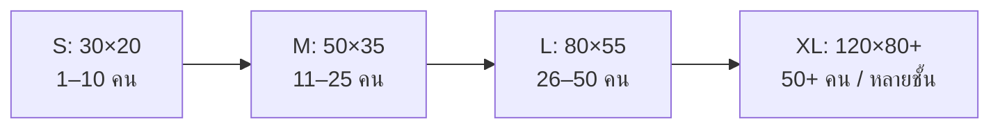
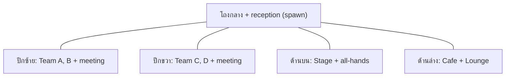
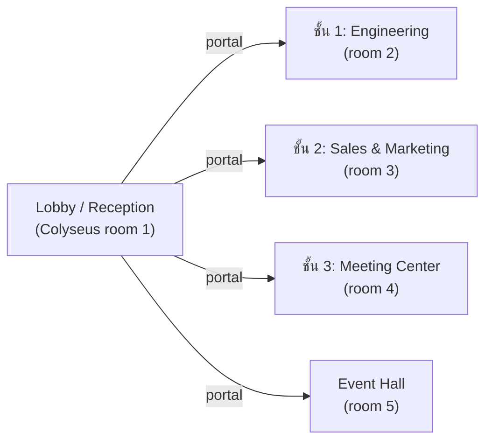

# 03 — ออฟฟิศ 4 ขนาด

กำหนดขนาด grid, จำนวนโซน และแนวทาง layout ของออฟฟิศแต่ละขนาด
ทุกตัวเลขคำนวณบนฐาน tile 32px และหลัก "พื้นที่ต่อคน" ที่ทำให้ไม่แออัดแต่ก็เจอกันง่าย

> **หลักการพื้นที่ต่อคน:** ประมาณ **9–16 tiles ที่เดินได้ต่อคน** (ไม่รวมกำแพง/เฟอร์นิเจอร์) — น้อยกว่านี้อึดอัด, มากกว่านี้เหงา/หากันไม่เจอ

---

## ตารางสรุป 4 ขนาด

| ขนาด | จำนวนคน | Grid (tiles) | Grid (px) | โซนหลัก | Colyseus room |
|------|---------|--------------|-----------|---------|---------------|
| **S — เล็ก** | 1–10 | 30 × 20 | 960 × 640 | 1 open space + 1 meeting + pantry | 1 room, no partition |
| **M — กลาง** | 11–25 | 50 × 35 | 1600 × 1120 | 2–3 team zones + 2 meeting + lounge + pantry | 1 room + spatial grid |
| **L — ใหญ่** | 26–50 | 80 × 55 | 2560 × 1760 | 4–5 team zones + 3 meeting + stage + cafe | 1 room + interest mgmt |
| **XL — ใหญ่มาก** | 50+ | 120 × 80 (หรือหลายชั้น) | 3840 × 2560 | หลาย district + portal เชื่อม | multi-room + portals |



---

## S — เล็ก (1–10 คน) · 30 × 20

**แนวคิด:** ห้องเดียวจบ เห็นทุกคนได้จากตรงกลาง เหมาะ startup/ทีมเล็ก

```
┌──────────────────────────────────────┐
│ [reception/spawn]      [pantry]        │
│                                        │
│   ▢▢ desk-cluster-4    ▢▢              │
│   ▢▢                    ▢▢             │
│                                        │
│        [lounge-corner]   ┌─meeting─┐   │
│                          │  8 seat │   │
│                          └─────────┘   │
└──────────────────────────────────────┘
```
- 1 open workspace (desk cluster 2 ชุด = 8 โต๊ะ)
- 1 ห้องประชุม (prefab `meeting-room-8`)
- pantry + lounge เล็ก
- spawn ที่ reception
- **ไม่ต้อง** interest management — ส่งสถานะทุกคนให้ทุกคนได้สบาย

---

## M — กลาง (11–25 คน) · 50 × 35

**แนวคิด:** แบ่งเป็นโซนทีม เริ่มมีทางเดินเชื่อม เห็นภาพรวมยังได้แต่ต้องเดินหากัน

```
┌───────────────────────────────────────────────┐
│ [reception]   Team A ▢▢▢▢      Team B ▢▢▢▢       │
│               ▢▢▢▢             ▢▢▢▢             │
│  ───────────────────  ทางเดินกลาง ──────────────│
│  ┌meeting─┐  ┌meeting─┐        [lounge + cafe]   │
│  │  6     │  │  8     │                          │
│  └────────┘  └────────┘   Team C ▢▢▢▢            │
│  [focus-booth ×3]                ▢▢▢▢            │
└───────────────────────────────────────────────┘
```
- 2–3 team zones (desk cluster อย่างละ 6–8 โต๊ะ)
- 2 ห้องประชุม + 3 focus booth (คุยเดี่ยว/โทรงาน)
- lounge + cafe
- **spatial grid** เริ่มมีประโยชน์ (แบ่ง cell ~16×16 tiles)

---

## L — ใหญ่ (26–50 คน) · 80 × 55

**แนวคิด:** เหมือน "ชั้นออฟฟิศจริง" มีปีกซ้าย-ขวา, โถงกลาง, พื้นที่ event

- 4–5 team zones แยกด้วยผนัง/กระจก
- 3 ห้องประชุมขนาดต่าง ๆ (4/8/16 ที่นั่ง)
- **stage area** (`Spotlight`) สำหรับ all-hands/ประกาศ
- cafe/pantry ใหญ่ + lounge หลายมุม
- **interest management จำเป็น** — client รับ update เฉพาะผู้เล่นใน cell รอบตัว (ดู [01 §5](01-tech-architecture.md))



---

## XL — ใหญ่มาก (50+ คน) · 120 × 80 หรือหลายชั้น

**แนวคิด:** ไม่ยัดทุกคนในแมพเดียว แต่ใช้ **หลาย district / หลายชั้น** เชื่อมด้วย `Portal`

2 กลยุทธ์ (เลือกหรือผสม):

### กลยุทธ์ A — แมพใหญ่ + districts
แมพเดียว 120×80 แบ่งเป็นย่าน (Engineering / Design / Sales / Commons) แต่ละย่านมี team zones ของตัวเอง ใช้ interest management เข้ม + culling การเรนเดอร์

### กลยุทธ์ B — หลายชั้น + portal (แนะนำสำหรับ 50+)

- แต่ละชั้น = Colyseus room แยก = โหลดกระจาย, จำนวนคนต่อ room คุมได้
- `Portal` object (จาก [02 §4](02-asset-and-tiled-pipeline.md)) ทำหน้าที่ประตูข้ามชั้น
- ผู้เล่นเห็น/ได้ยินเฉพาะคนใน room เดียวกัน = scale ได้ถึงหลายร้อยคนทั้งองค์กร

> **ข้อดีของ B:** LiveKit ก็แยก media room ตามชั้น → ไม่มีทางมี 200 คนใน SFU room เดียว, ต้นทุน media คุมได้

---

## แนวทางเลือกขนาดให้ลูกค้า
| จำนวนพนักงานจริง | แนะนำ |
|------------------|-------|
| ≤ 10 | S |
| 11–25 | M |
| 26–50 | L |
| 51–120 | XL กลยุทธ์ A (district เดียวใหญ่) |
| > 120 | XL กลยุทธ์ B (หลายชั้น/หลาย room) |

ทุกขนาดสร้างจาก **prefab ชุดเดียวกัน** ([02 §5](02-asset-and-tiled-pipeline.md)) ต่างกันที่จำนวนและการจัดวาง — ลดงานศิลป์ซ้ำ และคุมความสม่ำเสมอของสไตล์
