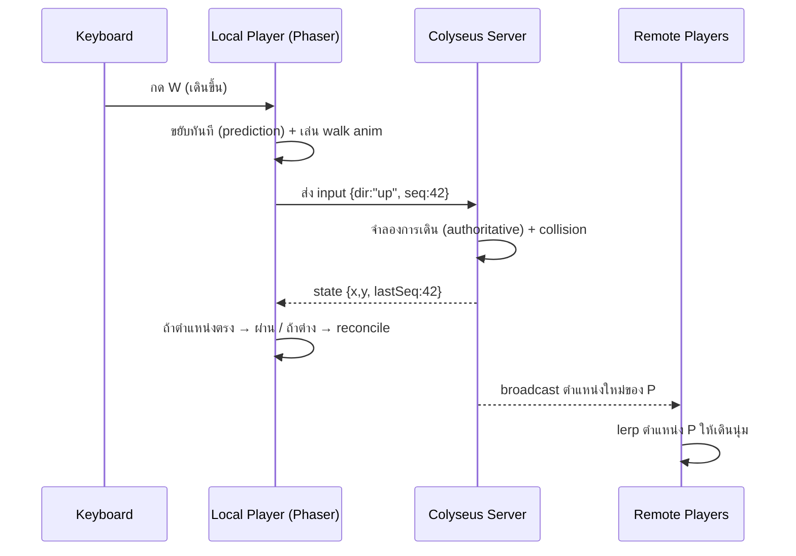
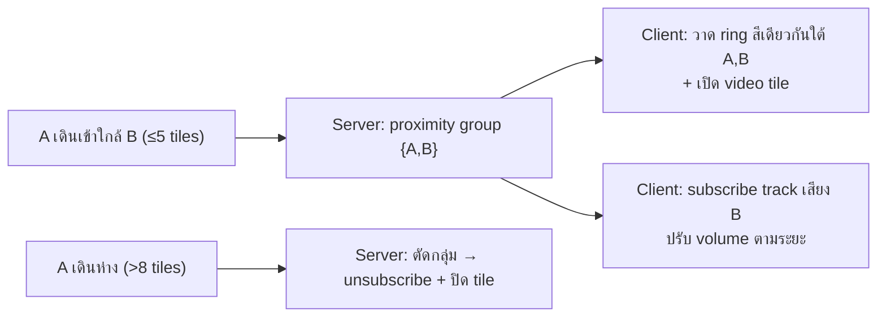
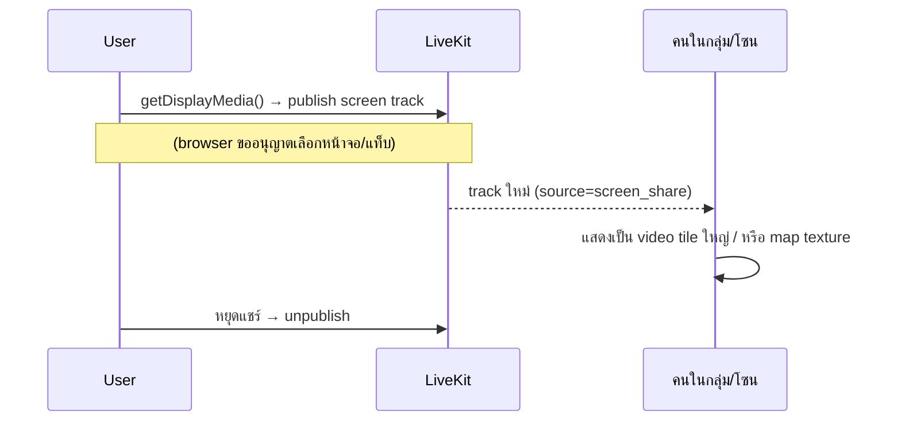

# 04 — ฟีเจอร์ Realtime (การเดิน, Proximity, Mic/Cam, Screen Share)

ลงรายละเอียดการทำงานของฟีเจอร์หลักที่ผู้ใช้ระบุ

---

## 1. การเดินแบบ Gather Town

Gather ให้ความรู้สึก "grid-based แต่ลื่น" — เดินทีละช่องแต่มี interpolation นุ่ม ๆ

### กลไก
| ส่วน | รายละเอียด |
|------|-----------|
| Input | WASD / ลูกศร (และแตะ/จอยบนมือถือภายหลัง) |
| Grid | เคลื่อนที่อ้างอิงช่อง 32px, ตรวจ collision ที่ระดับ tile/box |
| ความลื่น | **client-side prediction** — เดินทันทีที่กด ไม่รอ server |
| ความถูกต้อง | **server reconciliation** — server ยืนยันตำแหน่ง, ถ้าต่างมากค่อยดึงกลับ |
| คนอื่น | **interpolation** — remote player เคลื่อนนุ่มด้วยการ lerp ระหว่าง snapshot |
| Animation | spritesheet เดิน 4 ทิศ (idle + walk) เปลี่ยนตาม `dir`/`moving` |



### collision
- จาก tile ผนัง (`collides` property) + object layer `Collision`
- Phaser Arcade Physics: `physics.add.collider(player, wallLayer)` + `wallLayer.setCollisionByProperty({collides:true})`
- เก้าอี้/`Seat`: เดินชนแล้ว "นั่ง" (snap + หันทิศตาม property) แทนการกันชน

### tuning ให้เหมือน Gather
- ความเร็ว ~ 4 tiles/วินาที (ปรับได้)
- ไม่มี momentum/สไลด์ — หยุดคือหยุด
- อนุญาตเดินทแยงได้ (ปรับความเร็วทแยง = ×0.707 กันเร็วเกิน)

---

## 2. Proximity Chat — กรอบสนทนาเมื่อเข้าใกล้ ⭐

หัวใจของ virtual office: เดินเข้าใกล้กัน = เห็นกรอบสนทนา + ได้ยิน/เห็นวิดีโอกัน, เดินห่าง = จางหาย

### 2.1 การคำนวณระยะ (server-authoritative)
ทุก tick server คำนวณคู่ที่อยู่ในระยะ:

```
สำหรับผู้เล่นแต่ละคู่ (A,B):
  d = ระยะ (เป็น tiles) ระหว่าง A กับ B
  ถ้า A,B อยู่ "PrivateZone/MeetingRoom เดียวกัน":
      → เชื่อมกันเต็ม (ไม่สนระยะ) และตัดคนนอกโซนออก
  ไม่งั้นถ้า d <= NEAR (เช่น 5 tiles):
      → เชื่อมกัน, volume ตามระยะ
  ถ้า d > FAR (เช่น 8 tiles):
      → ตัดการเชื่อม
```
(ใช้ near/far ต่างกันเล็กน้อยเป็น **hysteresis** กันกระพริบตอนอยู่ขอบพอดี)

### 2.2 โซนพิเศษ
| โซน | พฤติกรรมเสียง |
|-----|--------------|
| **ทั่วไป (open space)** | ได้ยินคนในรัศมี ~5 tiles, ดังตามระยะ (spatial) |
| **PrivateZone / MeetingRoom** | ได้ยินเฉพาะคนในโซนเดียวกัน คนเดินผ่านข้างนอกไม่ได้ยิน |
| **Spotlight (เวที)** | คนบนเวทีพูดให้ทุกคนในแมพได้ยิน (ประกาศ/all-hands) |
| **focus-booth (capacity 1)** | ตัดเสียงทั้งหมด = โซนโฟกัสห้ามรบกวน |

### 2.3 กรอบสนทนา (visual)
2 แบบทำงานคู่กัน:
1. **Proximity ring/indicator** — วงหรือไฮไลต์ใต้เท้าคนที่อยู่ในกลุ่มสนทนาเดียวกัน (เช่น สีเดียวกัน) ให้รู้ว่า "กำลังคุยกับใครบ้าง"
2. **Speech/name bubble** — ป้ายชื่อเหนือหัวเสมอ + กรอบข้อความเมื่อพิมพ์แชต (ฟองคำพูดโผล่เหนือหัว แล้วจางไป)



### 2.4 การเชื่อมกับ media (ย้ำจาก [01 §4](01-tech-architecture.md))
Server ส่ง "proximity list" → client `subscribe/unsubscribe` LiveKit track เอง → SFU ส่ง media เฉพาะคู่ที่ใกล้ = ประหยัด bandwidth ในห้องใหญ่

---

## 3. Mic / Camera Toggle

### กลไก (LiveKit)
| การกระทำ | LiveKit API | ผลข้างเคียง |
|----------|-------------|-------------|
| เปิด/ปิดไมค์ | `setMicrophoneEnabled(bool)` | mute/unmute audio track |
| เปิด/ปิดกล้อง | `setCameraEnabled(bool)` | publish/unpublish video track |
| เลือกอุปกรณ์ | `switchActiveDevice()` | เปลี่ยน mic/cam/speaker |

### sync สถานะเข้าเกม
`micOn`/`camOn` เก็บใน Colyseus `Player` schema ด้วย → คนอื่นเห็น **ไอคอนไมค์/กล้องปิดเหนือหัว** ทันที (แม้ยังไม่ได้ subscribe media) เป็น UX สำคัญให้รู้ว่าใครพร้อมคุย

### UI (React HUD)
- แถบล่างจอ: ปุ่ม 🎤 / 📷 / 🖥️ (screen share) / 😀 (emote) / ⚙️ (settings)
- แสดง self-preview เล็ก ๆ ตอนเปิดกล้อง
- Push-to-talk (กด Space พูด) เป็น option

---

## 4. Screen Sharing

### 4.1 สองโหมด
| โหมด | ใช้เมื่อ | กลไก |
|------|---------|------|
| **แชร์ในกลุ่ม proximity** | คุยกลุ่มย่อย/ห้องประชุม | publish screen track → คนในกลุ่ม subscribe เห็นใน video tile |
| **แชร์ขึ้นจอใหญ่ในฉาก** | นำเสนอ/เวที | ยืนที่ `ScreenShare` object → track ไป render เป็น texture บน "จอ" ในแมพ ทุกคนในโซนเห็น |

### 4.2 flow


### 4.3 จอในฉาก (map screen)
- `MeetingRoom`/`ScreenShare` object มี `screenTargetId` ชี้ไปยัง "sprite จอ" ในแมพ
- เมื่อมีคนแชร์ในโซนนั้น เอา video track มา `applyToSprite` (วาด MediaStream ลง texture) → เห็นการนำเสนอบนจอในโลกเกม เหมือน Gather

---

## 5. ฟีเจอร์เสริมที่เข้ากันดี (แนะนำเผื่ออนาคต)
| ฟีเจอร์ | ใช้ object/ระบบ |
|--------|----------------|
| Emote / reaction (👍❤️😂) | broadcast ผ่าน Colyseus, เด้งเหนือหัว |
| Text chat (global + proximity + DM) | Colyseus message channel |
| Interactive objects (ไวท์บอร์ด, ลิงก์เอกสาร, มินิเกม) | `InteractObject` + embed iframe |
| Status (available/busy/away) | field ใน Player schema + สีป้ายชื่อ |
| Follow / locate เพื่อน | server ช่วยหา path/teleport-to |
| "Ghost/บินผ่าน" mode สำหรับแอดมิน | ปิด collision ชั่วคราว |

---

## 6. สรุปการแบ่งงานของฟีเจอร์
| ฟีเจอร์ | Server (Colyseus) | Client (Phaser/React) | Media (LiveKit) |
|--------|-------------------|----------------------|-----------------|
| เดิน | จำลอง+ยืนยันตำแหน่ง | prediction+interpolation | – |
| proximity | คำนวณกลุ่ม/โซน | วาด ring/bubble | subscribe ตามกลุ่ม |
| mic/cam | เก็บสถานะ+broadcast icon | ปุ่ม + preview | mute/publish track |
| screen share | รู้ว่าใครแชร์ในโซนไหน | render tile/map screen | publish screen track |
