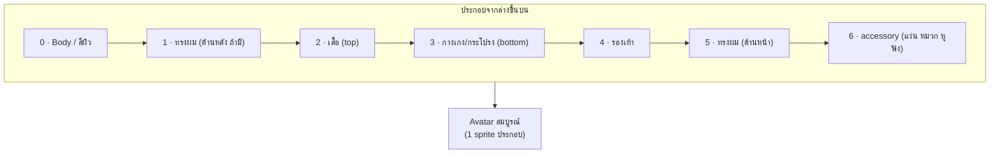
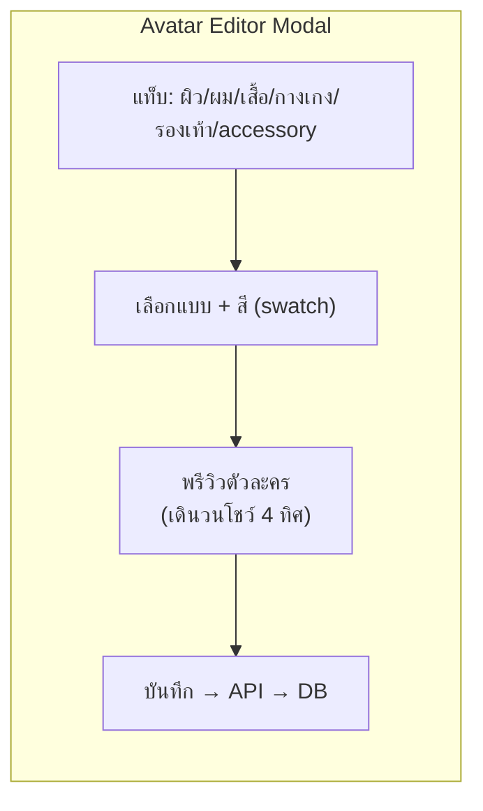

# 05 — ระบบสร้างตัวละคร (Avatar System)

ระบบให้ผู้ใช้ "สร้าง avatar ของตัวเอง" แบบ Gather — เลือกทรงผม สีผิว เสื้อผ้า ฯลฯ
ใช้เทคนิค **layered sprite composition** (ประกอบตัวละครจากชั้น ๆ)

---

## 1. หลักการ: Layered Sprite

ตัวละคร 1 ตัว = หลายชั้น sprite วาดซ้อนกัน แต่ละชั้นเป็น spritesheet ที่มี frame เดิน 4 ทิศ
ทุกชั้น **ขนาดเฟรมเท่ากันและ align กัน** (เช่น 32×48 px) เพื่อให้ซ้อนพอดี



> ทำไมไม่วาดตัวละครสำเร็จทีละแบบ? เพราะ combination เยอะมหาศาล (ผิว×ผม×เสื้อ×...) layered = จำนวน asset น้อย แต่ผสมได้ล้านแบบ

---

> 🎯 **Prompt สั่ง PixelLab สร้าง avatar (ครบ+ครอบคลุม):** [05a-pixellab-avatar-prompts](05a-pixellab-avatar-prompts.md)
> 🖼️ **ภาพอ้างอิง layout:** [`assets/avatars/_spec/avatar-spritesheet-layout.svg`](../assets/avatars/_spec/avatar-spritesheet-layout.svg)
> — frame grid 4 ทิศ × 5 เฟรม, layer stack, และ pivot guide (regenerate ได้ด้วย `assets/avatars/_spec/gen_avatar_sheet.py`)

## 2. Spritesheet spec

| พารามิเตอร์ | ค่า |
|------------|-----|
| ขนาดเฟรม | 32 × 48 px (กว้าง 1 tile, สูง 1.5 tile) — วาด @2x = 64×96 |
| ทิศทาง | 4 ทิศ: down, up, left, right (right = flip ของ left ได้เพื่อลด asset) |
| animation | idle (1–2 เฟรม) + walk (4–6 เฟรม) ต่อทิศ |
| layout | แถว = ทิศ, คอลัมน์ = เฟรม (มาตรฐานเดียวกันทุกชั้น) |
| pivot/origin | จุดเท้าอยู่ตำแหน่งเดียวกันทุกชั้น (สำคัญมาก) |

ตัวอย่าง layout ต่อชั้น:
```
        col0    col1    col2    col3   ...
row0  down-idle down-w1 down-w2 down-w3   (เดินลง)
row1  up-idle   up-w1   up-w2   up-w3     (เดินขึ้น)
row2  left-idle left-w1 left-w2 left-w3   (เดินซ้าย)
row3  right...  (หรือ flip จาก left)
```

---

## 3. หมวดที่ให้ผู้ใช้ปรับ (Customization slots)

| Slot | ตัวเลือก | หมายเหตุ |
|------|---------|----------|
| **สีผิว** | 6–8 โทน | ปรับ body layer |
| **ทรงผม** | 10–15 แบบ | มีชั้นหน้า/หลัง |
| **สีผม** | 8–10 สี | tint ได้ (ลด asset) |
| **เสื้อ** | 10–15 แบบ | เสื้อยืด/เชิ้ต/ฮู้ด/สูท |
| **กางเกง/กระโปรง** | 8–10 แบบ | |
| **รองเท้า** | 5–8 แบบ | |
| **accessory** | แว่น, หมวก, หูฟัง, เครา ฯลฯ | ใส่ได้หลายชิ้น |

### เทคนิคลดจำนวน asset: **tinting**
วาดผม/เสื้อเป็น grayscale แล้วใช้ Phaser `setTint()` ระบายสี → 1 ทรงผม × 10 สี = วาดแค่ 1 asset ประหยัดมาก (เหมาะกับผม, เสื้อพื้น)

---

## 4. การเก็บ & sync avatar

### 4.1 เก็บเป็น config (ไม่เก็บเป็นรูป)
```json
// avatar config ที่เก็บใน DB ต่อ user
{
  "avatarId": "usr_123",
  "body":   { "skin": 3 },
  "hair":   { "style": 7, "color": "#5b3a29" },
  "top":    { "style": 2, "color": "#2bb3a3" },
  "bottom": { "style": 1, "color": "#333" },
  "shoes":  { "style": 0 },
  "acc":    ["glasses_2", "headphones_1"]
}
```
- เบามาก sync ผ่าน Colyseus ได้ (แค่ `avatarId` → client ดึง config มา compose เอง)
- เปลี่ยนชุดแล้วเห็นทันทีทุกคน

### 4.2 การ compose ตอน runtime (Phaser)
2 ทางเลือก:
| วิธี | ข้อดี | ข้อเสีย |
|------|-------|--------|
| **Stacked sprites** (วาดหลาย sprite ซ้อน ผูก depth เดียวกัน) | ยืดหยุ่น เปลี่ยนชิ้นง่าย | sprite เยอะขึ้นต่อคน |
| **Pre-render to RenderTexture** (ประกอบเป็น texture เดียวตอนสร้าง) | เรนเดอร์เร็ว (1 sprite/คน) ดีกับห้องใหญ่ | ต้อง re-render เมื่อเปลี่ยนชุด |

**แนะนำ:** ห้องใหญ่ใช้ pre-render (RenderTexture) เพื่อ performance — ประกอบครั้งเดียวตอน join/เปลี่ยนชุด แล้วใช้เป็น sprite เดียว

---

## 5. Avatar Editor UI (React)


- พรีวิวเรียลไทม์ (เปลี่ยนแล้วเห็นทันทีบนตัวละครที่เดินโชว์)
- randomize button ("สุ่มลุค")
- เข้าถึงได้จาก onboarding ครั้งแรก + ปุ่มแก้ทีหลัง

---

## 6. Deliverables ของทีมศิลป์ (avatar)
1. **body spritesheet** × สีผิว (หรือ 1 ชุด + tint)
2. **hair set** (grayscale + แยกชั้นหน้า/หลัง) สำหรับ tint
3. **clothing sets** (top/bottom/shoes) — บางส่วน grayscale เพื่อ tint
4. **accessory set**
5. ทั้งหมดใช้ **layout/pivot มาตรฐานเดียวกัน** (ข้อ 2) — ย้ำ: align ให้ตรงเป๊ะ ไม่งั้นซ้อนเหลื่อม

---

## 7. เชื่อมกับระบบอื่น
- `avatarId` อยู่ใน Colyseus `Player` schema ([01](01-tech-architecture.md))
- ป้ายชื่อ + สถานะ (available/busy) วาดเหนือ avatar ([04 §2.3](04-realtime-features.md))
- ตอนกล้องปิด ใช้ avatar เป็นตัวแทนใน video tile ได้ (แสดงรูป avatar แทนวิดีโอดำ)
