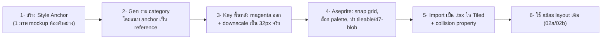

# 06 — Pixel Art Style & AI Asset Generation (Gemini)

เปลี่ยนสไตล์งานศิลป์เป็น **pixel art** แนว Stardew Valley / Gather Town
พร้อมเครื่องมือ AI ที่แนะนำ และ **คลัง prompt สำหรับ Gemini** ที่เอาไปใช้ได้ทันที

---

## 0. สิ่งสำคัญที่สุด: spec เดิมไม่เปลี่ยน เปลี่ยนแค่ "การวาด"

การเปลี่ยนเป็น pixel art **ไม่กระทบสถาปัตยกรรมหรือ spec ใด ๆ** ที่ทำไว้:

| ยังใช้ได้เหมือนเดิม | หมายเหตุ |
|---------------------|----------|
| Grid 32×32, layer structure ([02](02-asset-and-tiled-pipeline.md)) | เท่าเดิม |
| ผนัง 47-blob + atlas layout ([02a](02a-wall-tileset-spec.md)) | เท่าเดิม — แค่ช่องละภาพเป็น pixel art |
| Furniture catalog + footprint + prefab ([02b](02b-base-and-prefab-spec.md)) | เท่าเดิม |
| Avatar layer stack + frame grid ([05](05-avatar-system.md)) | เท่าเดิม |
| Tiled pipeline, custom property, Colyseus, LiveKit | เท่าเดิม |

> **สิ่งที่เปลี่ยน = เฉพาะ "รูปในแต่ละ tile/sprite" ให้เป็น pixel art** ภาพ SVG อ้างอิงที่ทำไว้ยังใช้เป็น "พิมพ์เขียวตำแหน่ง/ขนาด/ทิศ" ได้ 100% แค่วาดทับด้วยสไตล์ pixel

---

## 1. Pixel Art Style Spec (มาตรฐานที่ทุก asset ต้องตรงกัน)

| พารามิเตอร์ | ค่าที่กำหนด | หมายเหตุ |
|------------|-------------|----------|
| **Base tile** | **32 × 32 px** (1:1 pixel, ไม่ upscale ตอนวาด) | เท่า Gather; Stardew ใช้ 16px แต่ 32 มีที่ให้ดีเทลกว่า |
| **Pixel scale ตอนแสดง** | render ×2 หรือ ×3 (nearest-neighbor) | ห้าม smoothing — ต้องคมเป็นบล็อก |
| **มุมมอง** | top-down 2.5D (เอียงเล็กน้อย เห็นหน้าเฟอร์นิเจอร์/ผนังนิด ๆ) | แนว Gather |
| **Outline** | เส้นขอบ 1px สีเข้ม (selective outline — ไม่ต้องรอบทุกด้าน) | ให้ของเด่นจากพื้น |
| **Shading** | 2–3 เฉด/สี (base + shadow + highlight) | อย่าใช้ gradient นุ่ม |
| **แสง** | ทิศเดียวคงที่ **บน-ซ้าย** | เงาทุกชิ้นไปทางเดียว |
| **Dithering** | ใช้น้อย/ไม่ใช้ (สไตล์สะอาดแบบ Gather) | ถ้าอยากดิบขึ้นแบบ Stardew ใช้ dither เบา ๆ ได้ |
| **Palette** | จำกัด ~24–32 สี ทั้งเกม | ดู §2 |
| **Character** | ~16px กว้าง × 24–32px สูง (footprint 1 tile, หัวโผล่เหนือ tile) | สัดส่วน chibi น่ารัก |

### Stardew vs Gather — เลือกโทนไหน?
| | Stardew Valley | Gather Town |
|---|---|---|
| ดีเทล | สูง (texture ไม้/พืชละเอียด, dither) | เรียบ/แบน สะอาดตา |
| outline | บางส่วน | ชัดเจนรอบวัตถุ |
| palette | อุ่น เอิร์ธโทน | สดใส แบน |
| **แนะนำสำหรับออฟฟิศ** | — | **โน้มไป Gather (สะอาด อ่านง่าย)** + หยิบความอบอุ่นของ Stardew มาผสมโซน lounge/cafe |

---

## 2. Palette (pixel art) — ล็อกไว้ใช้ทั้งเกม

จำกัดสีเพื่อให้ทุก asset กลมกลืน (ใส่ใน Aseprite เป็น palette เดียว):

```
พื้น/ผนัง:  #f4ecd6  #e4d5b0  #cbb890   (ครีม/พื้น)
            #ffffff  #d8e0e8  #aab6c4   (ผนังขาว + เงา)
ไม้:        #c8945a  #a56b39  #6e421f
teal/แบรนด์: #46c7b8  #2b9d90  #1c6b62
พีช/accent: #f2a365  #d97b46
เขียวพืช:   #7cc576  #4f9a52  #34613a
เทา/โลหะ:   #cfd6dd  #9aa3ad  #5d656e
เข้ม/outline: #2b2a33  #45414d
ผิว(avatar): #ffd9b3 #f0b98d #c88a5e (หลายโทน)
```

> เก็บเป็นไฟล์ `assets/palette/nexspace.gpl` (Aseprite/GIMP palette) — บอก AI ให้ยึด palette นี้ด้วย (แนบเป็นภาพอ้างอิงได้)

---

## 3. ความจริงเรื่อง AI image-gen กับ pixel art (อ่านก่อนคาดหวัง)

AI สร้างภาพ "หน้าตา pixel art" ได้สวย แต่มี **ข้อจำกัดที่ต้องรู้**:

| ปัญหา | ผลกระทบ | ทางแก้ |
|-------|---------|--------|
| pixel grid **ไม่เป๊ะ 32px** (มี pixel เพี้ยน/เบลอ) | เอาเข้า Tiled ตรง ๆ ไม่ได้ | downscale + snap grid ใน Aseprite |
| **tileable ไม่จริง** (ต่อขอบไม่เนียน) | พื้น/ผนังปูแล้วเห็นรอย | แก้ขอบมือ / ใช้ tool ที่มีโหมด tileable |
| ทำ **autotile 47-blob ให้ต่อกัน** ไม่ได้ | ผนังมุมไม่ต่อ | generate "look" 1 ชิ้น แล้วประกอบ 47 เอง/ด้วย tool เฉพาะ |
| **สัดส่วน/ทิศตัวละคร** ไม่คงที่ข้ามเฟรม | walk cycle กระตุก | ใช้ tool ที่ทำ animation โดยเฉพาะ (PixelLab) |
| พื้นหลังโปร่งใสจริงมักทำไม่ได้ | ต้อง key ออก | สั่งให้พื้นหลังเป็นสีทึบ (magenta #FF00FF) แล้วลบ |

**สรุป:** AI = ได้ "หน้าตา/คอนเซ็ปต์/sprite เดี่ยว" เร็วมาก แต่ **ต้องเก็บงานใน Aseprite เสมอ** ก่อนเข้า Tiled โดยเฉพาะพวก tileable/autotile

---

## 4. เครื่องมือ AI ที่แนะนำ (เรียงตามเหมาะกับงานเกม)

| อันดับ | เครื่องมือ | จุดเด่น | ใช้ทำอะไร |
|--------|-----------|---------|-----------|
| ⭐1 | **PixelLab.ai** | สร้าง pixel character + **animation 4/8 ทิศ**, tileset, หมุนมุม, มี Aseprite plugin/API | **ตัวละคร + walk cycle + tileset** (ตรงงานเราสุด) |
| ⭐2 | **Retro Diffusion** | โมเดล SD เฉพาะ pixel art, **โหมด tileable**, ล็อก palette, Aseprite plugin | **พื้น/ผนัง/เฟอร์นิเจอร์** ที่ต้อง tileable |
| 3 | **Gemini (2.5 Flash Image / "Nano Banana")** | เก่งความ **consistency + แก้ภาพด้วย reference**, คุยแก้เป็นรอบ ๆ | **mockup ห้อง, sprite เดี่ยว, iterate ชุดให้สไตล์เดียวกัน** (เครื่องมือที่คุณจะใช้) |
| 4 | **Scenario.gg** | เทรน style ของตัวเองได้ → asset library โทนเดียวกันทั้งชุด | ถ้าต้องการ asset จำนวนมากโทนเดียว |
| — | **Aseprite** (ไม่ใช่ AI) | มาตรฐาน pixel art: snap grid, palette, tileable preview, animation | **เก็บงานทุกชิ้นก่อนเข้า Tiled (ขาดไม่ได้)** |

> **แนวทางคุ้มสุดสำหรับทีมเล็ก:** Gemini เจน mockup/คอนเซ็ปต์ให้เห็นภาพรวม → PixelLab ทำตัวละคร+อนิเมชัน → Retro Diffusion ทำ tileset → Aseprite เก็บงาน+ทำ 47-blob → Tiled

### ⭐ วิธีใช้ PixelLab ให้ถูก (สำคัญ — output เป็น 32px transparent ใช้ได้ทันที)
PixelLab สร้าง **สไปรต์เดี่ยว 32×32 โปร่งใส native** (ไม่ต้อง downscale!) แต่ต้องป้อนให้ถูก:

| ทำ ✅ | อย่าทำ ❌ |
|-------|----------|
| gen **ทีละ object** ("office chair, top-down") | ยัด prompt tile-sheet หลายชิ้นในครั้งเดียว → มันงงทำออกมาปนกัน 29 เฟรม |
| ตั้งขนาด **32×32**, view = **top-down / low top-down** | ปล่อย view เป็น side/hero |
| พื้นหลัง **transparent** | สั่ง "magenta background" → PixelLab จะ**ระบาย magenta ทับสไปรต์** (ต้องมาคีย์ออกทีหลัง) |
| ระบุ palette/สีให้ล็อก ("teal chair, warm wood") | ปล่อยสีอิสระ → เก็บของหลายสีปนกัน |

**Prompt template ต่อ 1 ชิ้น (PixelLab):**
```
[office chair] seen from directly above, flat top-down view for a 2D office game.
32x32 pixel art, transparent background, warm palette [teal fabric / wood],
1px dark outline, 2-3 shades, light from top-left, crisp clean pixels.
```
เปลี่ยน `[...]` เป็น: office desk / potted plant / wooden stool / rug / bookshelf / fridge ฯลฯ ทีละชิ้น

---

## 5. Workflow แนะนำ (AI → เกม)



**หัวใจความ consistency:** สร้าง **Style Anchor 1 ภาพก่อน** (เช่น mockup ห้องประชุมเล็ก) แล้วทุก prompt ถัดไป **แนบภาพ anchor เป็น reference** พร้อมสั่ง "keep identical palette, outline weight, and lighting" — Gemini/Nano Banana เก่งเรื่องนี้มาก

---

## 6. คลัง Prompt สำหรับ Gemini (คัดลอกใช้ได้เลย)

> เขียนเป็นภาษาอังกฤษ (โมเดลตอบดีกว่า) · ปรับคำในวงเล็บ `[...]` ตามต้องการ
> เทคนิค: รอบแรก gen "style anchor" ก่อน; รอบต่อไปอัปโหลด anchor แล้วขึ้นต้นด้วย *"Using the attached image as the exact style reference (same palette, 1px outlines, top-left lighting)…"*

> ### 🔒 TOP-DOWN LOCK (แปะต่อท้ายทุก prompt ที่มีฉาก/ห้อง/เฟอร์นิเจอร์)
> คำเดิม "2.5D / perspective / room" ทำให้ Gemini ออกมาเป็น **isometric** — ใช้บล็อกนี้บังคับ top-down:
> ```
> STRICT flat orthographic TOP-DOWN view (bird's-eye), camera pointing straight
> down at 90 degrees, like Gather Town maps and Stardew Valley ground tiles.
> Walls are drawn as thin top-down strips with only a few pixels of front face.
> NEGATIVE (must avoid): isometric, isometric projection, diamond/diagonal grid,
> 3D perspective, perspective tilt, vanishing point, angled/tilted view, drop shadow room.
> ```

### 6.1 Master Style Anchor (เจนก่อนเป็นอันดับแรก) — TOP-DOWN LOCKED ✅
> เวอร์ชันนี้บังคับ top-down ชัดเจน + สั่งจัดเป็น "tile sheet" แทน "room render" (กันภาพ 3D)
```
A pixel art TILE SHEET for a 2D top-down virtual-office game.

VIEW (most important): STRICT flat orthographic TOP-DOWN view, bird's-eye,
camera pointing straight down at 90 degrees — exactly like Gather Town maps
and Stardew Valley ground tiles. Every tile is a flat square seen from directly above.

DO NOT (must avoid): isometric, isometric projection, diamond or diagonal grid,
3D perspective, perspective tilt, vanishing point, angled or tilted camera,
a drawn 3D room, or drop-shadowed room boxes.

CONTENT: arrange these as separate flat sprites on a clean grid, each in its own
cell with even spacing, all on a solid flat magenta (#FF00FF) background:
- 3 floor tiles (32x32, seamless): wood plank, cream tile, gray carpet — top-down.
- Wall pieces (32x32) shown from above as thin strips with a few px of front face:
  straight-horizontal, straight-vertical, outer-corner, inner-corner, T-junction.
- Furniture seen from straight above: office desk with monitor, office chair,
  potted plant, rug.

STYLE: 32x32 pixel tiles, crisp clean pixels (no anti-aliasing, no blur).
Limited warm palette: cream floors, white + teal walls, warm wood furniture,
soft green plants, peach accents. Light source from TOP-LEFT.
Selective 1px dark outlines, 2-3 shades per color, minimal dithering, readable.
```

> 💡 ถ้ายังหลุดเป็น iso อีก: ลบคำว่า "office/room" ออกให้หมด, ย้ำ "flat tiles seen from directly above, like a top-down RPG tileset (RPG Maker style)", และ gen แยกทีละหมวด (floor แยก, wall แยก, furniture แยก) แทนภาพรวม

### 6.2 Floor tiles (ต้อง tileable)
```
Using the attached image as the exact style reference, generate a set of 8
SEAMLESS TILEABLE floor tiles for a pixel art office game, each 32x32 pixels,
top-down. Tiles: light cream tile, warm beige tile, wood plank floor, gray carpet,
teal carpet, marble, concrete, and a small accent rug pattern.
Arrange them in a single row, evenly spaced, each tile isolated with a 2px gap,
on a flat magenta (#FF00FF) background. Crisp pixels, no blur, seamless edges.
```

### 6.3 Wall pieces (สไตล์ — แล้วประกอบ 47-blob เองทีหลัง)
```
Using the attached style reference, generate pixel art WALL pieces for a modern
white office wall with a subtle 2.5D height (visible front face), 32x32 px each.
Provide these pieces on a magenta (#FF00FF) background in a labeled row:
straight-horizontal, straight-vertical, outer-corner (top-left), inner-corner,
T-junction, wall-end, and a doorway opening.
Consistent 1px dark outline, top-left light, clean pixels, tileable edges.
```
> จากชิ้นเหล่านี้ ประกอบครบ 47 เคสตาม [02a](02a-wall-tileset-spec.md) ใน Aseprite (หรือใช้ PixelLab/Retro Diffusion โหมด autotile)

### 6.4 Furniture catalog sheet
```
Using the attached style reference, generate a pixel art furniture sprite sheet
for an office game, top-down 2.5D, matching the exact palette and outline style.
Items, each isolated on a flat magenta (#FF00FF) background, arranged in a neat grid
with even spacing, drawn at their listed tile footprint (1 tile = 32x32 px):
office desk (2x1), L-desk (2x2), office chair facing down (1x1), filing cabinet (1x1),
bookshelf (2x1), long meeting table (4x2), whiteboard (2x1), presentation screen (2x1),
2-seat sofa (2x1), armchair (1x1), coffee table (2x1), tall plant (1x2),
kitchen counter (2x1), fridge (1x2), coffee machine (1x1), water cooler (1x1).
Crisp pixels, top-left lighting, soft drop shadow under each item.
```

### 6.5 เฟอร์นิเจอร์ทิศต่าง ๆ (chair/sofa 4 ทิศ)
```
Using the attached style reference, generate one pixel art office chair in 4 facing
directions: facing DOWN, UP, LEFT, RIGHT. 32x32 px each, in a horizontal row,
isolated on magenta (#FF00FF). Keep the same chair design, only rotate the facing.
Crisp pixels, top-left light.
```

### 6.6 Avatar base + walk cycle
```
Using the attached style reference, generate a cute chibi pixel art CHARACTER
for a virtual-office game, ~16px wide x 24px tall, top-down 2.5D.
Create a walk-cycle sprite sheet: 4 rows (facing DOWN, UP, LEFT, RIGHT),
each row 4 frames of a walking animation. Neutral base character: light skin,
short brown hair, teal t-shirt, dark pants. Consistent proportions across all frames,
foot position aligned to the bottom-center of each 32x48 cell.
Isolated on flat magenta (#FF00FF), crisp pixels, 1px outline, top-left light.
```

### 6.7 Avatar customization pieces (layered)
```
Using the attached character as the exact base, generate PIXEL ART HAIR options
that fit this character's head perfectly, same size and pixel grid, facing down.
Provide 6 hairstyles in a row on magenta (#FF00FF): short, bob, ponytail, curly,
bun, spiky. Grayscale-friendly shading so it can be recolored. Crisp pixels.
```
> ทำซ้ำกับ tops / bottoms / accessories — ย้ำ "same head/body position" เพื่อให้ layer ซ้อนตรง ([05](05-avatar-system.md))

### 6.8 Full room mockup (ไว้พรีเซนต์/เป็น anchor โซนต่าง ๆ)
```
Using the attached style reference, generate a pixel art STRICT flat orthographic
TOP-DOWN (bird's-eye, straight overhead 90°) view of a
[meeting room / lounge / pantry / open workspace] for a virtual-office game,
matching the exact palette, 1px outlines and top-left lighting. Include
[long table + 8 chairs + wall screen / sofas + rug + plants / counter + fridge + coffee].
Walls as thin top-down strips. Crisp pixels, cozy and clean, readable layout.
DO NOT use isometric, diamond grid, 3D perspective, or tilted camera.
```

---

## 7. เทคนิคเฉพาะ Gemini / Nano Banana
- **แนบ reference ทุกครั้ง**: อัปโหลด style anchor + (ถ้ามี) ภาพ palette → สั่ง "match this exactly"
- **แก้เป็นรอบ (conversational)**: "make the outline darker", "reduce dithering", "align to a 32px grid" — Nano Banana แก้ภาพเดิมได้ดี
- **พื้นหลัง**: สั่ง magenta `#FF00FF` เสมอ แล้วลบด้วย Aseprite (Select by color) หรือ remove.bg
- **ขนาด**: โมเดลออกภาพใหญ่/ไม่ตรง 32px — เอาเข้า Aseprite แล้ว `Sprite > Resize` (nearest) ให้ tile = 32px จริง ก่อน snap
- **อย่าคาดหวัง grid เป๊ะจาก AI** — มองว่า AI = ร่าง/สไตล์, Aseprite = ทำให้ใช้ได้จริง

---

## 8. Checklist การแปลงเป็น pixel art
- [ ] สร้าง `nexspace.gpl` palette + gen Style Anchor 1 ภาพ (ยึดเป็นมาตรฐาน)
- [ ] Floor 10 แบบ (tileable, ทดสอบปูเต็มพื้นไม่เห็นรอย)
- [ ] Wall pieces → ประกอบ 47-blob ([02a](02a-wall-tileset-spec.md)) + collision
- [ ] Furniture 25 ชิ้น ตาม footprint ([02b](02b-base-and-prefab-spec.md)) + ทิศครบ
- [ ] Avatar base + walk 4 ทิศ + ชุด customization (layer ตรง pivot)
- [ ] ทุกชิ้นผ่าน Aseprite: snap 32px grid, ล็อก palette, พื้นหลังโปร่งใส
- [ ] Import เข้า Tiled ตาม pipeline เดิม → ทดสอบในเกม

---

## 9. Placeholder pixel art ที่สร้างไว้แล้ว (ใช้ Phase 1 ได้ทันที)

อยู่ใน `assets/tilesets/pixel/` — เป็น PNG จริง pixel art เข้า Tiled ได้เลย (คุณภาพ placeholder, ของจริงค่อยแทนด้วย AI+Aseprite):

| ไฟล์ | เนื้อหา | ใช้ใน Tiled |
|------|--------|-------------|
| `floor-pixel.png` | พื้น 7 แบบ tileable (32px/tile, แถวเดียว) | tile-grid tileset → Floor layer |
| `walls-white-pixel.png` | **ผนัง 47-blob ครบ** (8 คอลัมน์ ตาม [02a](02a-wall-tileset-spec.md)) | Wang/Terrain set → Walls layer |
| `furniture/*.png` | เฟอร์นิเจอร์ 18 ชิ้น (แยกไฟล์ ตาม footprint [02b](02b-base-and-prefab-spec.md)) | Collection of Images → Objects layer |
| `*-preview.png` | ภาพพรีวิว/ห้องตัวอย่าง (พิสูจน์ tileable/autotile) | — (ดูเฉย ๆ) |

สร้างใหม่/ปรับสีได้ด้วย `gen_pixel_floors.py`, `gen_pixel_walls.py`, `gen_pixel_furniture.py` (`python <script>.py .`)

> **ยังขาด (แนะนำไป AI+Aseprite):** ตัวละคร avatar + walk cycle, เฟอร์นิเจอร์ทิศอื่น ๆ, ธีมผนังอื่น, ประตู/หน้าต่างละเอียด — ใช้ prompt §6 กับ PixelLab/Gemini
