# 07 — Asset Processing Workflow: จากภาพ Gemini → เข้าเกม

ลำดับงานครบถ้วนสำหรับแปลงภาพที่ AI (Gemini) เจนออกมา ให้กลายเป็น asset ที่ใช้ใน Tiled + Phaser ได้จริง
ใช้ต่อจาก [06 (prompt & style)](06-pixel-art-style-and-ai-prompts.md)

---

## ⚠️ STEP 0 — ตัดสินใจก่อน: Isometric หรือ Top-down? (สำคัญที่สุด)

ภาพที่ Gemini เจนจาก prompt 6.1 ออกมาเป็น **isometric** (มุมเอียงทแยง) ไม่ใช่ **top-down** แบบ Gather Town
สองแบบนี้ **ผสมกันไม่ได้** และกระทบงานเบื้องหลังต่างกันมาก ต้องเลือกทางเดียว:

| | 🔷 Isometric (ภาพที่ได้ตอนนี้) | ⬛ Top-down 2.5D (Gather-style) |
|---|---|---|
| หน้าตา | หรูกว่า มีมิติ สวยแบบ "cozy room" | เรียบ อ่านง่าย เหมือน Gather |
| Tiled | ต้องใช้ map orientation = **Isometric/Staggered** | Orthogonal (ปกติ) |
| Tile base | diamond **64×32** | square **32×32** |
| ผนัง autotile | 47-blob **ใช้ไม่ได้** ต้องทำ wall แบบ iso (ชุดต่างหาก) | ✅ ใช้ 47-blob ที่ทำไว้ ([02a](02a-wall-tileset-spec.md)) |
| Collision/เดิน | คำนวณบนแกน iso (ยากกว่า) | grid ธรรมดา (ง่าย) |
| Depth sort | ต้องจัด z ตามแนว iso | y-sort ตรงไปตรงมา |
| Avatar | ต้องวาด 4–8 ทิศแบบ iso | 4 ทิศ ปกติ |
| placeholder ที่ทำไว้ (floor/wall/furniture) | ❌ ใช้ไม่ได้ (คนละมุม) | ✅ ใช้ได้ทันที |

### คำแนะนำ
- **อยากได้เร็ว + ตรง spec/โค้ดที่วางไว้ + เหมือน Gather** → **regenerate เป็น top-down** โดยเติมใน prompt:
  > `orthographic TOP-DOWN view, straight overhead angle, NOT isometric, no perspective tilt`
  แล้วทุกอย่างที่ทำมา (47-blob, placeholder, spec) ใช้ได้หมด
- **หลงรักลุค isometric นี้จริง ๆ + ทีมรับงาน engine เพิ่มได้** → commit ทาง iso (ผมจะปรับ [01](01-tech-architecture.md)/[02a](02a-wall-tileset-spec.md) ให้เป็น iso: Tiled isometric, Phaser iso, iso wall set, iso collision)

> เอกสารด้านล่างเขียนแบบครอบทั้งสองทาง — จุดที่ต่างจะระบุ **[ISO]** / **[TOP-DOWN]**

---

## เครื่องมือที่ต้องเตรียม
| เครื่องมือ | ใช้ทำ | ฟรี? |
|-----------|-------|------|
| **Aseprite** | เก็บงาน pixel, snap grid, ล็อก palette, export | มีค่าใช้จ่าย (มาตรฐาน) |
| Photopea / GIMP | ทางเลือกฟรีแทน Aseprite (คีย์สี, crop) | ✅ |
| **Tiled** | สร้าง tileset + แมพ | ✅ |
| Phaser project | โหลด asset เข้าเกม | ✅ |
| (option) remove.bg / Aseprite magic wand | ลบพื้นหลัง | — |

---

## ภาพรวม pipeline

```mermaid
flowchart LR
    G["ภาพ Gemini<br/>(1 ภาพใหญ่ + legend)"] --> S1["1· ตัดสินใจสไตล์"]
    S1 --> S2["2· ล็อก palette"]
    S2 --> S3["3· crop ชิ้นส่วน"]
    S3 --> S4["4· ลบ magenta"]
    S4 --> S5["5· downscale + snap grid"]
    S5 --> S6["6· cleanup ใน Aseprite"]
    S6 --> S7["7· ตั้งชื่อ/จัด atlas ตาม spec"]
    S7 --> S8["8· สร้าง tileset ใน Tiled + collision"]
    S8 --> S9["9· ประกอบแมพ + Meta"]
    S9 --> S10["10· export JSON + validate"]
    S10 --> S11["11· โหลดใน Phaser"]
    S11 --> S12["12· เจน asset ที่เหลือ (สไตล์เดียวกัน)"]
```

---

## STEP 1 — จัดระเบียบไฟล์ + ยืนยันสไตล์
1. เซฟภาพต้นฉบับไว้เป็น reference: `assets/_reference/anchor-gemini-01.png`
2. ตัดสินใจ ISO หรือ TOP-DOWN (STEP 0) — **อย่าข้าม** เพราะกำหนดทุก step ถัดไป
3. ถ้าเลือก TOP-DOWN แต่ภาพนี้เป็น iso → กลับไป regenerate ก่อน (ดู STEP 0) แล้วค่อยมาต่อ

## STEP 2 — สร้าง Master Palette แล้วล็อก
1. เปิดภาพใน Aseprite → `Sprite > Color Mode` ดูสีที่ใช้
2. `Palette > Create Palette from Sprite` → ได้ palette จากภาพจริง
3. ลดสีให้เหลือ ~24–32 สี (รวมเฉดใกล้กัน) → เซฟ `assets/palette/nexspace.gpl`
4. **ทุก asset หลังจากนี้ยึด palette นี้** (index color) เพื่อให้ทั้งเกมกลมกลืน

> ⚙️ **STEP 3–5 อัตโนมัติได้:** ใช้ [`assets/_reference/slice_anchor.py`](../assets/_reference/slice_anchor.py)
> — คีย์ magenta + ตัดแยกสไปรต์ + ตั้งชื่อ + downscale ให้อัตโนมัติ
> รัน: `python slice_anchor.py <ภาพ.jpg> _wip` → ได้ `_wip/cutouts/` (full-res โปร่งใส) + `_wip/downscaled/` + `_wip/_contact-sheet.png`
> เหลือแค่งานมือใน Aseprite (STEP 6): เก็บ pixel ขอบ, ทำ floor tileable, ประกอบ 47-blob, snap footprint

## STEP 3 — Crop ชิ้นส่วนจาก legend
> ใช้ "ชิ้นใน legend" (กลุ่ม 1 floor, 2 wall, 3 furniture) เป็น asset จริง ส่วน "ห้องตัวอย่าง" ใช้เป็นภาพอ้างอิงเฉย ๆ

1. crop floor tiles ทีละใบ (กลุ่ม 1)
2. crop wall pieces ทีละชิ้น (กลุ่ม 2) — flat / corner / T / end ฯลฯ
3. crop furniture ทีละชิ้น (กลุ่ม 3): desk, chair, monitor, keyboard, rug, plant, bookshelf, water-cooler, coffee-machine ...
4. เซฟชั่วคราวเป็นไฟล์ ๆ ใน `assets/_wip/`

## STEP 4 — ลบพื้นหลัง magenta (#FF00FF)
1. Aseprite: `Select > by color` คลิกพื้น magenta → `Delete` → เหลือโปร่งใส
   (หรือ Photopea: Magic Wand คลิก magenta → Delete)
2. ตรวจขอบ: ถ้ามีขอบ magenta หลงเหลือ (fringe) ลบ pixel ขอบทิ้ง
3. ตั้ง layer เป็น transparent, ไม่มีพื้นหลัง

## STEP 5 — Downscale + Snap เข้ากริด (หัวใจ! AI ไม่เคยตรง grid)
> ภาพ AI มักใหญ่/pixel ไม่ตรง 32px จริง ต้องบังคับให้เข้ากริด

1. วัดว่า 1 tile ในภาพ = กี่ px (เช่น ~150px)
2. **[TOP-DOWN]** ตั้งเป้า floor/wall = **32×32**; furniture = ทวีคูณของ 32
   **[ISO]** ตั้งเป้า floor diamond = **64×32**; ของสูงเผื่อความสูง
3. Aseprite: `Sprite > Sprite Size` → resize แบบ **Nearest-neighbor** ลงให้ tile = ขนาดเป้าหมาย
4. เปิด grid (`View > Grid > Grid Settings` = 32×32 หรือ 64×32) → snap
5. ถ้าหลัง downscale แล้วเบลอ/pixel เพี้ยน → แก้มือทีละ pixel (นี่คือเหตุผลที่ AI ต้องมีคนเก็บงาน)

## STEP 6 — Cleanup ใน Aseprite
1. เก็บ outline ให้คม 1px (ถ้า AI ทำ outline หนา/ขาด)
2. ลด/เพิ่มเฉดให้เหลือ 2–3 เฉดต่อสี (ตาม [06 §1](06-pixel-art-style-and-ai-prompts.md))
3. **[floor/wall] ทำ tileable:** `Edit > Tile mode` หรือใช้ offset (`S`) เลื่อนภาพครึ่งหนึ่งแล้วแก้รอยต่อ ให้ปูซ้ำไม่เห็นตะเข็บ
4. จัด **anchor ของเฟอร์นิเจอร์ = ขอบล่างกึ่งกลาง** (เผื่อ y-sort)
5. export ทุกชิ้นเป็น PNG โปร่งใส

## STEP 7 — จัด atlas + ตั้งชื่อตาม spec
1. **Floor** → รวมเป็น tile-grid sheet (32px/tile) เหมือน placeholder `floor-pixel.png`
2. **Walls:**
   - **[TOP-DOWN]** ประกอบเป็น **47-blob** ตาม index [02a](02a-wall-tileset-spec.md) (วาดมุม/แยกที่ขาดเพิ่มจาก wall pieces ที่ AI ให้) → `walls-white.png`
   - **[ISO]** จัดเป็นชุด iso wall (ผนังซ้าย/ขวา/มุม/ประตู) — connection scheme แบบ iso
3. **Furniture** → แยกไฟล์ต่อชิ้น (Collection of Images) ตั้งชื่อตาม [02b](02b-base-and-prefab-spec.md): `desk.png`, `office-chair.png` ...
4. วางไฟล์เข้าโฟลเดอร์จริง: `assets/tilesets/`, `assets/tilesets/furniture/`

## STEP 8 — สร้าง Tileset ใน Tiled + ตั้ง collision/property
1. **[ISO]** ตอนสร้าง Map ตั้ง `Orientation = Isometric` (หรือ Staggered), tile 64×32
   **[TOP-DOWN]** `Orientation = Orthogonal`, tile 32×32
2. **Floor tileset:** New Tileset (based on image) → `floor.tsx`
3. **Wall tileset:**
   - **[TOP-DOWN]** เพิ่ม **Terrain/Wang Set (Corner)** → ทาสีมุมทุก tile ([02a §8](02a-wall-tileset-spec.md)) → ระบายผนังอัตโนมัติได้
   - **[ISO]** ใส่เป็น tile ธรรมดา/objects วางเอง
4. **Furniture:** New Tileset → **Collection of Images** → เพิ่มทุกไฟล์
5. ตั้ง **custom property** ต่อ tile: `collides` (bool), `layer` (objects/above), `anchor=bottom`, `dir`, `interact` — ตาม [02b §3](02b-base-and-prefab-spec.md)
6. เซฟ `.tsx` ทุกอัน

## STEP 9 — ประกอบแมพ + Meta layers
1. สร้าง layer ตามลำดับ [02 §2](02-asset-and-tiled-pipeline.md): Floor / FloorDecor / Walls / Furniture_Below / Objects / Furniture_Above / Collision / Meta / Lighting
2. ปูพื้น → ระบายผนัง (Terrain brush) → วางเฟอร์นิเจอร์ (Objects)
3. วาง **Meta objects**: `Spawn`, `Portal`, `PrivateZone`, `MeetingRoom`, `ScreenShare` (custom types [02 §4](02-asset-and-tiled-pipeline.md))
4. (option) เซฟกลุ่มเป็น **prefab template `.tx`** ([02b §4](02b-base-and-prefab-spec.md))

## STEP 10 — Export JSON + Validate
1. `File > Export As` → **Tiled JSON (.tmj/.json)**, layer encoding = CSV/uncompressed
2. รัน validation ([02 §7](02-asset-and-tiled-pipeline.md)): เช็ค spawn ครบ, portal ชี้ถูก, zoneId ไม่ซ้ำ, ผนังมี collides
3. เก็บเข้า `assets/maps/` + อัปโหลด S3

## STEP 11 — โหลดใน Phaser (Phase 1)
1. `this.load.image('floor', ...)`, `this.load.tilemapTiledJSON('office', 'office-small.json')`
2. สร้าง layer: `map.createLayer('Floor', ...)`, `map.createLayer('Walls', ...)`
3. collision: `wallLayer.setCollisionByProperty({ collides: true })`
4. อ่าน Meta objects → สร้าง spawn/zone/portal
5. **[ISO]** ใช้ Phaser isometric helper + จัด depth ตามแนว iso
   **[TOP-DOWN]** เดิน grid + `physics.add.collider(player, wallLayer)` + y-sort
6. ทดสอบ: เดินชนผนัง, y-sort ถูก, spawn ถูกจุด

## STEP 12 — เจน asset ที่เหลือให้สไตล์เดียวกัน
> ใช้ภาพ anchor นี้เป็น reference ทุกครั้ง เพื่อคุมความ consistency
1. **Avatar + walk cycle** → prompt [06 §6.6](06-pixel-art-style-and-ai-prompts.md) (แนบ anchor)
   - **[ISO]** ขอ 4–8 ทิศแบบ iso
2. เฟอร์นิเจอร์ทิศอื่น, ธีมผนังอื่น (glass/wood/brick), ประตู/หน้าต่าง, ของตกแต่งเพิ่ม
3. ทุกชิ้นวน STEP 3–8 เหมือนเดิม
4. ทำ prefab เพิ่มให้ครบ 7+ ([02b](02b-base-and-prefab-spec.md))

---

## Checklist สั้น (ต่อ 1 ชุด asset)
- [ ] เลือกสไตล์ (iso/top-down) แล้ว
- [ ] ล็อก palette จากภาพ
- [ ] crop + ลบ magenta + downscale ตรง grid
- [ ] cleanup Aseprite + tileable + anchor bottom
- [ ] ตั้งชื่อ/จัด atlas ตาม spec (02a/02b)
- [ ] Tiled: tileset + Wang set + collision property
- [ ] ประกอบแมพ + Meta + export JSON + validate
- [ ] โหลด Phaser ผ่าน + เดิน/ชน/y-sort ถูก
- [ ] เจนที่เหลือด้วย anchor เดิม

---

## ⏱️ ประเมินเวลาโดยคร่าว (ต่อ 1 แมพชุดแรก)
| งาน | เวลาโดยประมาณ |
|-----|----------------|
| เก็บ palette + crop + clean ชุดแรก | ครึ่ง–1 วัน |
| ประกอบ 47-blob / iso wall | 2–4 ชม. |
| ตั้ง Tiled tileset + property | 1–2 ชม. |
| ประกอบแมพเล็ก + export | 1–2 ชม. |
| โหลด Phaser + debug | ขึ้นกับความพร้อมโค้ด |
